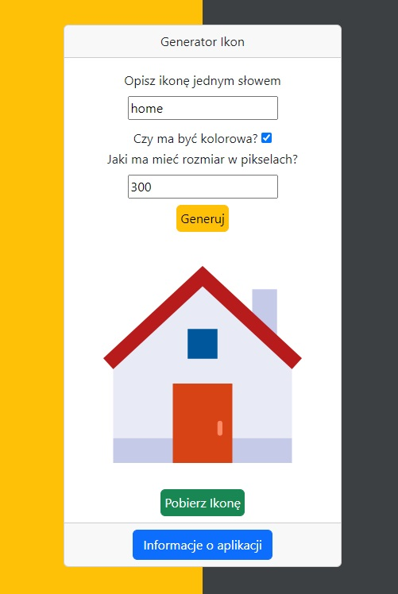

# :desktop_computer: IconGenerator

The application allows for the generation of icons with user-selected parameters, with a maximum size of 300px x 300px. The user also has the option to download the generated icon. The application uses the icons8 API and filesaver.js.

## :framed_picture: Screenshots

## :joystick: Demo

https://kamilkeder.github.io/IconGenerator/

## :e-mail: Feedback

If you have any feedback, please reach out to me at kontaktkkeder@gmail.com
